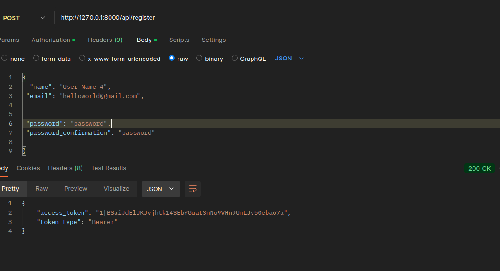
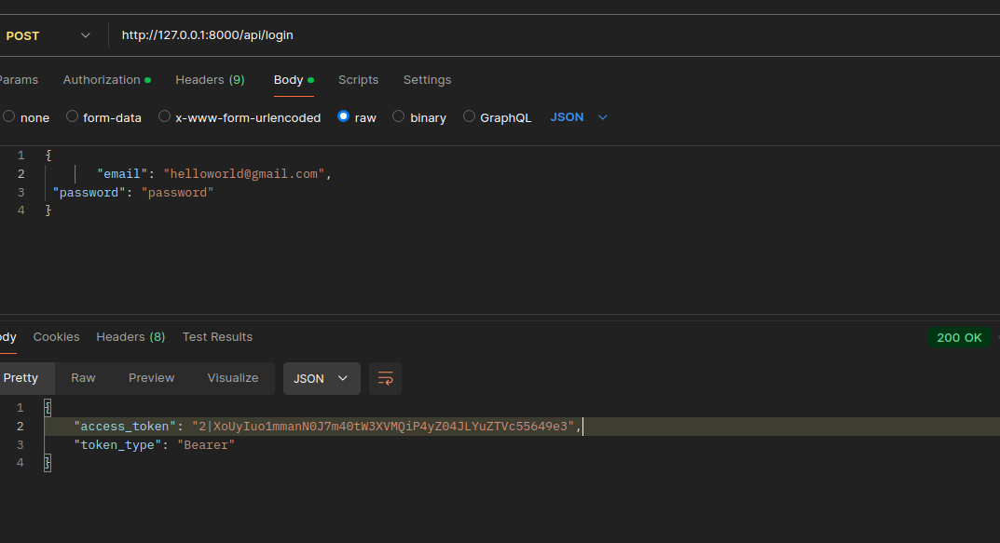
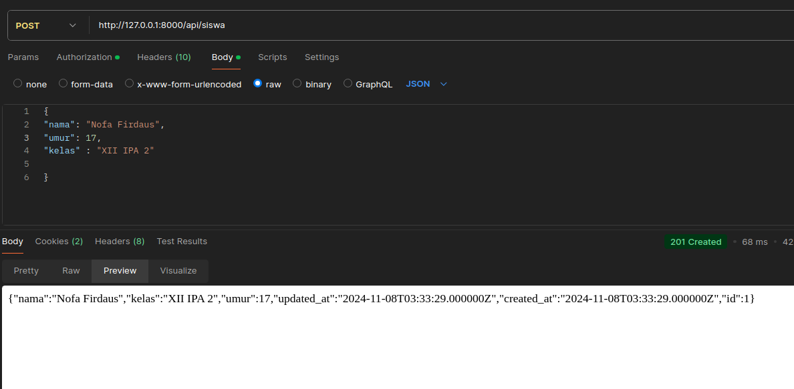
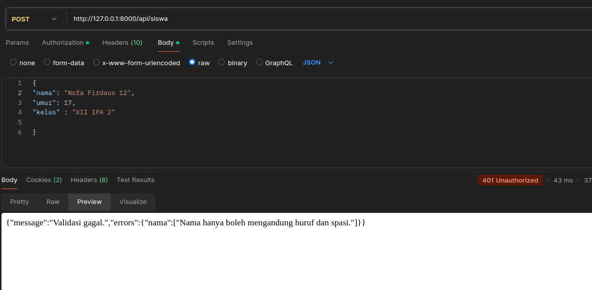
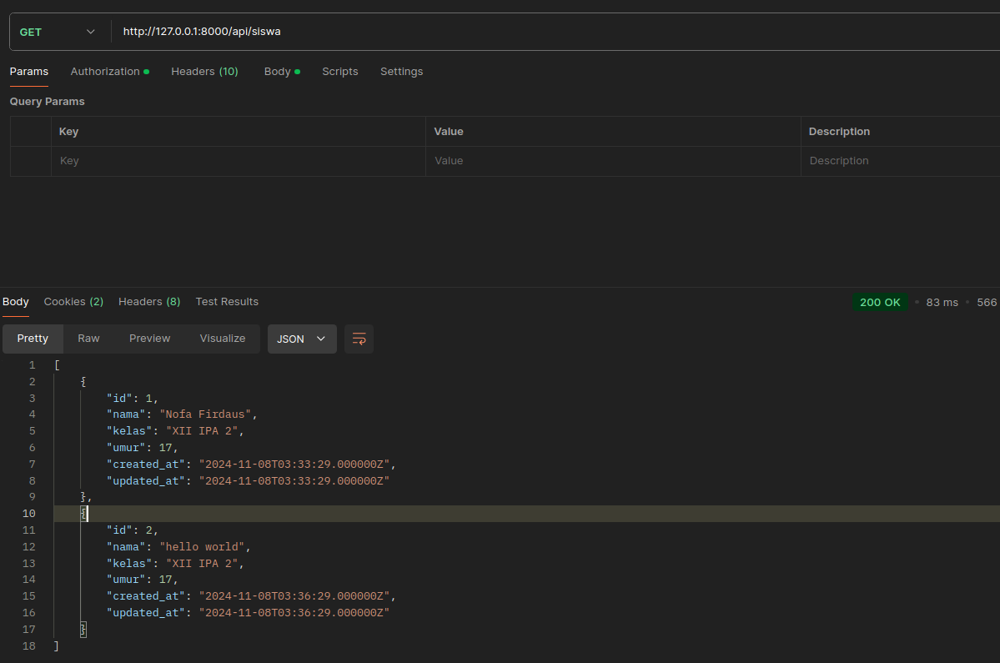
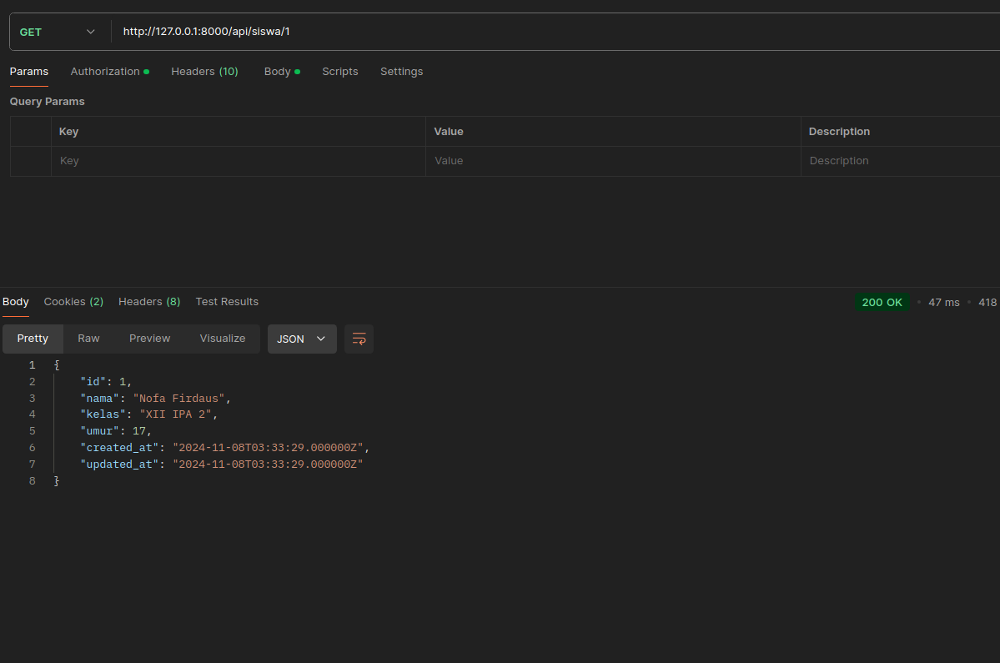
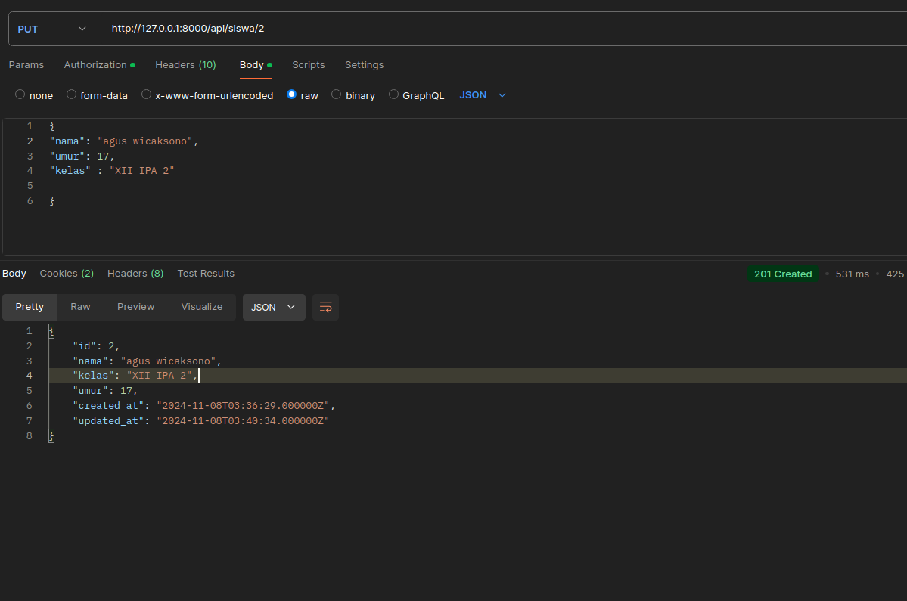
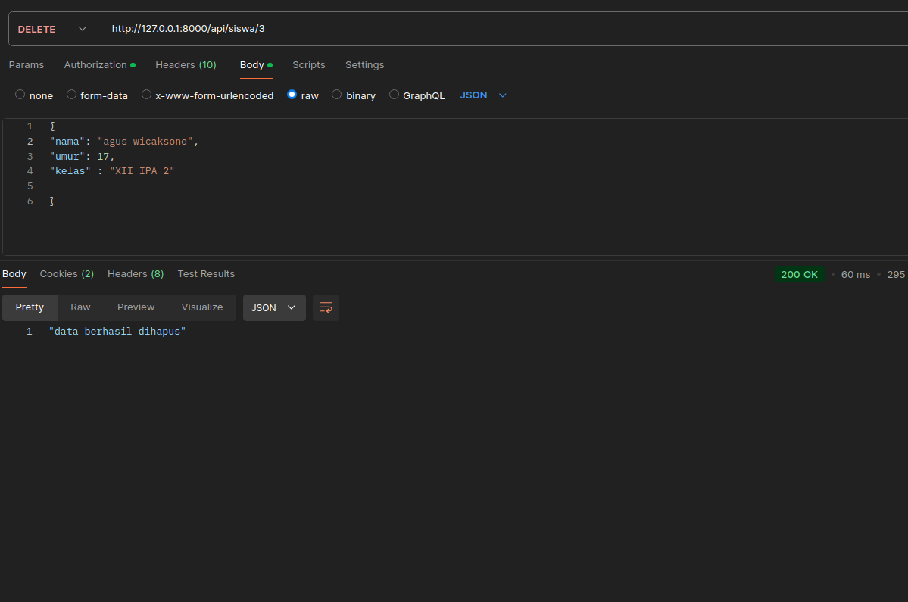

# Registasi

# Login

# Nama Siswa Harus mengandung	huruf	dan	spasi.
- Menggunkan regex untuk mambatasi karakter.
- validasi benar.

- validasi salah dan menambahkan pesan kesalahan.

# Mengambil data siswa.

# Mengambil data siswa berdasarkan id.

# Update data siswa.

# Delete data siswa.

